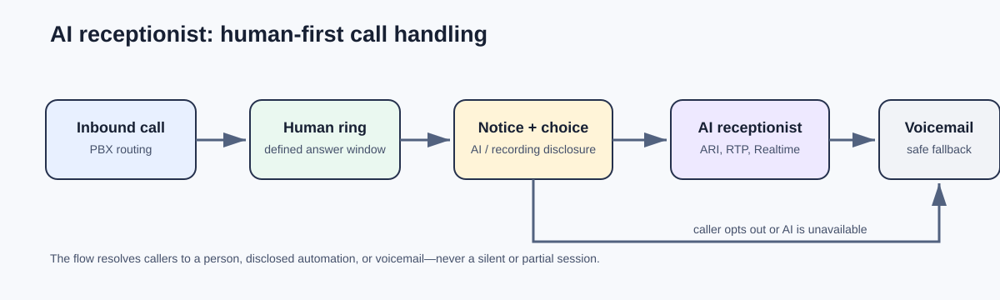
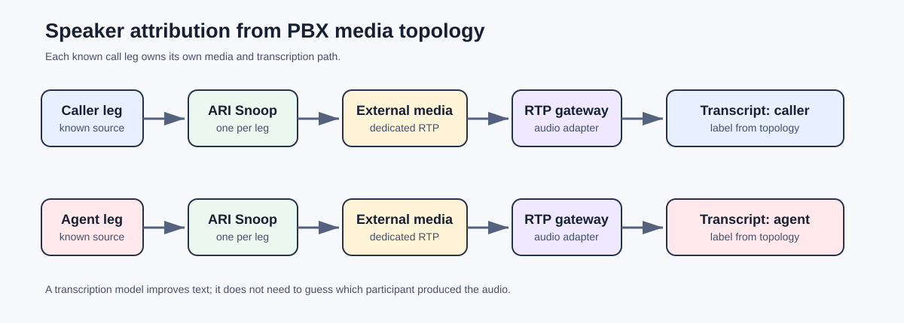

# Real-Time Voice Systems

Practical, trustworthy voice infrastructure by Daniel Haines: human-first
AI reception, speaker-attributed transcription, and controlled SIP/Realtime
systems.

This is a public engineering portfolio and technical reference—not a hosted
telephony product. It documents the decisions behind real systems while keeping
customer data, recordings, endpoints, and operational configuration private.

## Start here

- **Want to see how call attribution can be reliable?** Read the
  [speaker-attributed transcription case study](docs/case-studies/asterisk-call-leg-transcription.md)
  and its [reference implementation](https://github.com/Operlane-Systems/asterisk-call-leg-transcription).
- **Interested in responsible AI call handling?** Start with the
  [AI receptionist case study](docs/case-studies/operlane-receptionist.md).
- **Exploring SIP/RTP and low-latency AI?** See the
  [SIP Realtime lab](docs/case-studies/sip-realtime-prototypes.md) and its
  [public examples](examples/sip-realtime-lab/).

## What Daniel builds

- **AI reception systems** that preserve human-first call handling and provide
  explicit fallback paths.
- **Speaker-attributed transcription** built from PBX media topology rather
  than speaker-label guesses from a mixed recording.
- **SIP and Realtime prototypes** that exercise signaling, RTP media, G.711
  audio, turn detection, and operational logging end to end.

## Featured work

### AI receptionist for Asterisk/FreePBX

A production-oriented inbound-call design that rings a human first, presents
the AI/recording notice before automated processing, supports an opt-out route,
and sends callers to voicemail if the AI service is unavailable.

[Read the case study](docs/case-studies/operlane-receptionist.md) ·
[View the architecture](docs/architecture/ai-receptionist.md)

### Speaker-attributed call transcription

Real-time and post-call transcription patterns that preserve a separate media
path per call leg. The result is attributable by PBX topology, not inferred
from mixed audio.

[Read the case study](docs/case-studies/asterisk-call-leg-transcription.md) ·
[View the architecture](docs/architecture/attributed-transcription.md) ·
[Reference implementation](https://github.com/Operlane-Systems/asterisk-call-leg-transcription)

### SIP Realtime lab

Controlled extension-to-extension simulators for buyer-persona and interview
practice. They connect SIP/RTP media to an OpenAI Realtime session while
retaining native G.711 mu-law where practical.

[Read the case study](docs/case-studies/sip-realtime-prototypes.md) ·
[View the architecture](docs/architecture/sip-realtime-lab.md) ·
[Browse the examples](examples/sip-realtime-lab/)

## Engineering approach

Daniel designs voice systems around observable media paths, explicit failure
behavior, testable conversation state, and careful handling of sensitive call
data. The supporting notes describe the approach:

- [Audio and media paths](docs/engineering/audio-and-media-paths.md)
- [Reliability and fallback behavior](docs/engineering/reliability-and-fallbacks.md)
- [Privacy and recording considerations](docs/engineering/privacy-and-call-recording.md)
- [Testing strategy](docs/engineering/testing-strategy.md)

## Demonstration

A synthetic call-leg-transcription demonstration is in production. It will show
separate caller and agent streams, labeled transcript events, and the resulting
attributed output—without using a real call recording. See
[the demo brief](assets/demo/README.md).

## Public-scope note

This repository intentionally contains no credentials, production endpoints,
phone numbers, recordings, raw call transcripts, customer data, or PBX
configuration. Private systems are represented through sanitized technical
case studies and architecture material only.

## Contact

Daniel Haines · [GitHub](https://github.com/hainesdev) ·
[Portfolio](https://dhaines.dev)

I welcome conversations about real-time audio, speech systems, mobile audio,
telephony infrastructure, and applied AI engineering.
